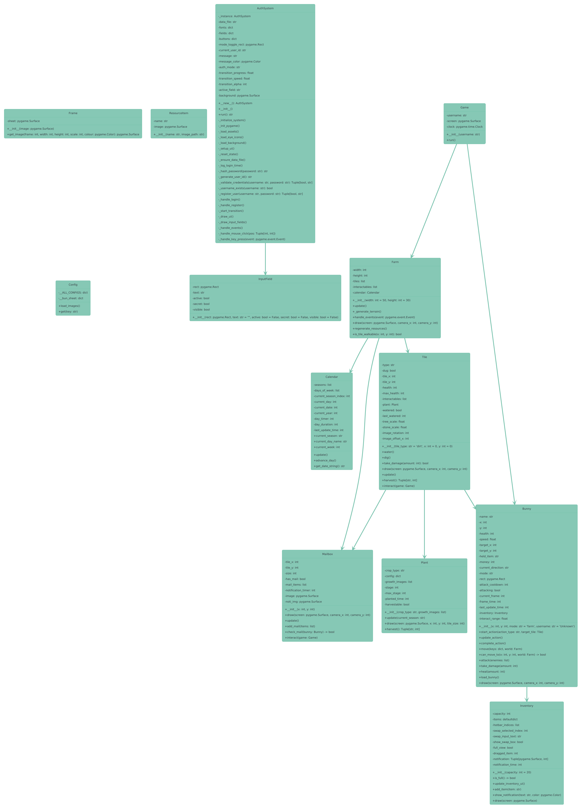

# Bunny is on Farm

## Overview
**Bunny is on Farm** is a farming simulation game with dungeon exploration elements, featuring a bunny protagonist. Players manage their farm while periodically exploring procedurally generated dungeons to gather rare resources. The game combines Stardew Valley-inspired farming mechanics with Zelda-like dungeon exploration.

### Key Features:
- **Seasonal Farming System**: Grow crops affected by seasons with different growth cycles
- **Resource Management**: Collect and manage resources to upgrade tools and expand your farm
- **Dungeon Exploration**: Battle enemies in procedurally generated dungeons
- **Day/Night Cycle**: Time management affects gameplay
- **Inventory System**: Manage collected items and equipment
- **Data Tracking**: Game records player statistics and progress

## Game Mechanics

### Farming System
- Plant and harvest crops with seasonal variations
- Manage soil conditions and watering
- Upgrade farming tools to improve efficiency
- Sell crops at the market to earn money

### Dungeon System
- Explore randomly generated dungeons
- Battle various enemies with different behaviors
- Collect rare resources unavailable on the farm
- Solve simple puzzles to progress

### Technical Implementation
- Pygame-based 2D rendering
- CSV-based data logging
- JSON save system
- Procedural generation for dungeons and mazes

## UML Class Diagram

## Youtube Video
[YT link](https://youtu.be/guUlpyN4niA?feature=shared)
